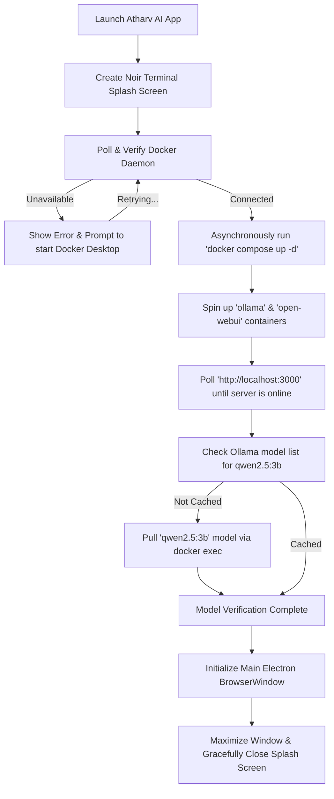

# 🌌 Atharv AI (Open Wrapper)

[](package.json)
[](#)
[](#)
[](#)

Atharv AI is an elegant, premium desktop wrapper built with **Electron** that encapsulates a fully self-contained, high-performance local AI runtime. By orchestrating **Docker** containers under the hood, the application seamlessly provisions a visual frontend powered by **Open WebUI** and a local inference backend powered by **Ollama**, automatically loading and caching the highly capable **Qwen 2.5 (3B)** model.

Instead of wrestling with CLI setups and manual environment configuration, Atharv AI handles the entire pipeline on launch via a retro-modern noir-styled terminal splash screen that updates in real-time, giving you a smooth, native app experience for private offline AI.

---

## ✨ Features

- **📺 Noir Terminal Splash Screen**: A customized startup splash screen that visually prints a real-time log of the Docker health check, container boot sequence, server availability polling, and AI model verification.
- **🐳 Automagic Docker Orchestration**: Seamlessly detects whether the Docker Desktop daemon is running. Automatically executes `docker compose up -d` asynchronously on boot and connects the local network volumes.
- **🧠 Zero-Config Local Inference**: Connects with Ollama to automatically check for the local cache of the `qwen2.5:3b` model, downloading and pulling it directly inside the container pipeline if not already present.
- **⚡ Native Window Features**:
  - Automatically launches the web server client at maximized view.
  - Interactive smart zoom controls: Zoom-in (`Ctrl + =` or `Ctrl + WheelUp`), Zoom-out (`Ctrl + -`), and Zoom-reset (`Ctrl + 0`).
  - Quick-access DevTools trigger (`Ctrl + Shift + I`) for developers and customization.
- **📦 Enterprise Packaging Ready**: Equipped with **Electron Builder** configurations to instantly compile and build standardized, production-ready Windows Installer (`.msi`) packages.

---

## 🛠️ System Architecture

The following lifecycle sequence details how **Atharv AI** bridges your host system shell, the Electron environment, Docker containers, and the native browser frame on startup:



---

## ⚙️ Prerequisites

Before launching or compiling the application, ensure you have the following software installed:

1. **[Node.js](https://nodejs.org/)** (v18.x or later recommended)
2. **[Docker Desktop](https://www.docker.com/products/docker-desktop/)** (must be active or set to start on system boot)
3. **Git** (if contributing or cloning the source)

---

## 🚀 Quick Start (Running Locally)

Follow these simple steps to set up your developer environment and run the application locally:

### 1. Clone & Navigate
```bash
git clone https://github.com/atharv-rem/open-wrapper.git
cd open-wrapper
```

### 2. Install Dependencies
Initialize the Node modules inside the root directory:
```bash
npm install
```

### 3. Launch the Application
Make sure your Docker Desktop is open and run the start script:
```bash
npm start
```
*The noir splash screen terminal will boot, verify Docker, launch the containers, check the model configuration, and transition smoothly into the main chat window.*

---

## 📦 Building the Installer (Production)

Atharv AI uses **Electron Builder** to package the application into a single executable or standard Windows Installer (`.msi`).

To compile the application for production:
```bash
npm run dist
```

Upon compilation, the installer and its unpackaged assets will be stored in the `/dist` directory:
- **Output Artifact**: `dist/Atharv AI.msi`
- **Application Directory**: Configured with automatic desktop shortcuts and installation paths.

> [!NOTE]
> The build settings in `package.json` are optimized to bundle the core Electron app bundle while leaving the heavier Docker volume data inside Docker's native volume storage. The `docker-compose.yml` is bundled as an extra external file so the packaging remains lightweight.

---

## 📂 Configuration Breakdown

### File Layout
- **[main.js](main.js)**: Orchestrates the application lifecycle, splash screens, child process executions (`exec`), and window zoom listeners.
- **[docker-compose.yml](docker-compose.yml)**: Defines isolated, network-connected containers for Ollama and Open WebUI.
- **[package.json](package.json)**: Manages Electron dev dependencies, app IDs, author metadata, and electron-builder rules.
- **[assets/icon.ico](assets/icon.ico)**: Custom application system icon used for the app window and installer packaging.

### Port Mappings
The container network exposes the following host endpoints:
- **`3000`**: Maps to Open WebUI's main web dashboard (accessible in-app or via `http://localhost:3000`).
- **`11434`**: Maps to Ollama's local inference backend, allowing extra custom scripts to connect if needed.

---

## 🔧 Troubleshooting

> [!IMPORTANT]
> **Docker Daemon Unavailable**: If the application shows `[ERROR] Docker daemon unavailable` on startup, it means the Docker engine is not running on your host system. Simply double-click **Docker Desktop** to start the engine, and the splash screen will automatically resume the pipeline once it connects.

### Common Solutions

| Issue | Potential Cause | Resolution |
| :--- | :--- | :--- |
| **Port 3000 or 11434 is already in use** | Another local server (like React or a standalone Ollama instance) is running on the host. | Stop the conflicting processes, or edit the ports mapping in `docker-compose.yml` and rebuild/re-run. |
| **Download stuck on "Downloading AI model..."** | Network bandwidth issues or firewall blocking connection to Ollama registries. | Ensure your internet connection is active. You can monitor Docker logs with `docker logs -f ollama` in your terminal to see progress. |
| **Splash screen freezes at "Waiting for Open WebUI..."** | Docker containers are taking longer than normal to boot or index their database on the first run. | Wait a moment (timeout is set to a generous 120 seconds). On the very first run, Docker needs to download the raw images which might take several minutes depending on internet speed. |

---

## 📜 License

This project is licensed under the MIT License. Feel free to fork, customize, and build your own private desktop assistants!

Developed with 💜 by **Atharv Remeshan**.
